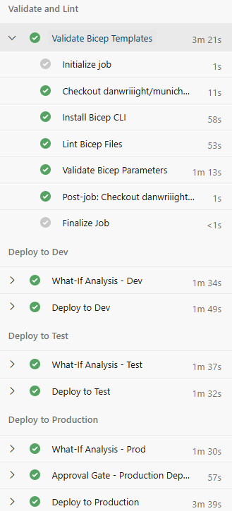

# munichRE-tech-assessment

## TODO: Populate and remove this

It should briefly cover:
- What is included
- Why you chose Bicep
- How the Key Vault design is production-ready
- How secrets are injected securely
- How multi-environment deployment works
- How the Azure DevOps pipeline is secured
- How the Ansible playbook handles Linux and Windows
- Assumptions, trade-offs, and enterprise improvements
- Where AI was used and how you validated it

 Use short supporting markdown files in /docs for the deeper explanation. That makes it easier to review and feels closer to a real engineering handover.

# Overview 

We are delivering a production-ready Azure Key Vault deployment built with Bicep, parameterized for dev/test/prod, secured via RBAC, soft delete, purge protection, and private endpoints, plus an Azure DevOps pipeline that validates, plans, and deploys safely, and an Ansible playbook that configures Linux and Windows web hosts while pulling secrets from Key Vault without hardcoding. 

The repository is structured to separate infrastructure, pipeline, and configuration management concerns, with supporting docs that explain security, tradeoffs, and assumptions for a clean engineering handover.

# Repository Structure

```
.
├─ README.md
├─ PATH
├─ ansible/
│  ├─ README.md
│  ├─ playbook.yml
│  ├─ group_vars/
│  │  ├─ linux_web.yml
│  │  └─ windows_web/
│  │     └─ vault.yml
│  └─ inventory/
│     └─ hosts.ini
├─ bicep/
│  ├─ main.bicep
│  ├─ modules/
│  │  └─ keyvault.bicep
│  └─ parameters/
│     ├─ dev.bicepparam
│     ├─ test.bicepparam
│     └─ prod.bicepparam
├─ docs/
│  ├─ ai-usage.md
│  ├─ architecture.md
│  ├─ assumptions.md
│  ├─ pipeline-security.md
│  ├─ security.md
│  └─ tradeoffs.md
└─ pipelines/
   └─ azure-pipelines.yml
```

# Task 1: Bicep Key Vault Solution 

## Reasons for choosing Bicep:
- Azure-first estate: My understanding from conversations with the team is that MunichRE is an Azure first estate
- Developer Skillset: I (as the only developer working on this project) have more recently used Bicep than Terraform
- Azure Managed State: No external state file to manage

### Reasons we could've chosen Terraform:
- Cloud-agnostic estate: Terraform works well for hybrid / multi-cloud estates or if we want to future proof against cloud migrations
- Developer Skillset: If the team already have experience with HCL / if modules are already built in Terraform.

## Production Readiness
Production Readiness is demonstrated through:
- **RBAC managed:** Access is controlled centrally via Azure AD roles, enabling least privilege and auditable, scalable permission management.
- **Soft delete:** Protects against accidental or malicious deletion by allowing recovery of deleted secrets and vaults within a retention period. 
- **Purge protection:** Prevents permanent deletion even after soft delete, ensuring critical secrets cannot be irreversibly removed.
- **Deny Public Access:** Restricts exposure from the public internet by enforcing a default deny network posture, reducing the overall attack surface.
- **Explicit network rules:** (see `bicep/modules/keyvault.bicep`) Enforces tightly controlled access by allowing only approved IPs or networks, complementing the default deny model.
- **Secrets can be injected at runtime using Key Vault references and service principal with federated identity in the pipeline:** (no secrets in source; see `pipelines/azure-pipelines.yml). Removes secrets from code and pipelines, reducing leakage risk and enabling secure, dynamic secret retrieval.
- **Environment separation via parameter files:** (in bicep/parameters/ with pipeline stage selection) Ensures consistent deployments while isolating configurations across dev/test/prod, reducing risk of cross-environment impact.

Planned Enhancements:
- **Private Endpoints** Will enable fully private connectivity over the Azure backbone, removing reliance on public endpoints.

## Secret Injection
- As above, we use a service principal with federated identity (for Azure DevOps Pipelines)
- Other secret injection patterns incl:
    - Managed Identity - best for Azure Services; managed without credentials 
    - Service Principal w/ Client Secret - best for CI/CD
    - Client Certificate Authentication - best for on-prem apps or third party integrations

## Multi Environment Setup
- In our solution, we use separate bicep parameter files and separate resource groups with strict RBAC to manage separate environments
- An alternatives for managing multi-env setups is separate subscriptions per envt with identical templates and different service connections (great for managing billing separately per env)

# Task 2: Azure DevOps pipeline



- The pipeline is organized into stage-based deployments (dev → test → prod) with a consistent flow: 
    - validate and lint Bicep
    - run `what-if` against the target environment
    - then deploy using the environment-specific `.bicepparam` file (see `pipelines/azure-pipelines.yml` and `bicep/parameters/`). 
    - Each stage can consume outputs from the previous one only when appropriate, keeping environments isolated while still enabling promotion.
- Authentication uses a service connection configured for workload identity (OIDC) rather than secrets. The pipeline never stores static credentials; it requests short‑lived tokens at runtime and retrieves secrets from Key Vault only when needed for deployment tasks (no secrets in repo or variable groups).
- Production is protected via Manual Approvals (person to review the Production WhatIf for unintended actions)
- Quality and safety checks include Bicep compilation, linting, `what-if` previews, and (optionally) policy compliance checks before apply. This makes drift and non‑compliant changes visible before any deployment happens.
- Rollback is handled by redeploying the last known‑good build (artifacts are immutable) or, for infrastructure, by reverting to the previous parameter set and re‑running the deployment. Because Key Vault is declarative and protected by soft delete/purge protection, recovery is safe even if a change needs to be undone.

Further Enhancements:
- Protection via Azure DevOps Environments with required approvals and checks. This includes manual approval gates and optional branch policies on the main branch so only reviewed changes can reach prod.
- Azure Policy can audit, deny, or sometimes remediate non-compliant resources, and it evaluates whether deployed resources meet organisational rules

# Task 3: Ansible playbook

## TODO: 
- [ ] Explain:
  - [ ] OS-specific handling
  - [ ] Idempotency
  - [ ] Credential handling
  - [ ] CI/CD integration

# Security Considerations

TODO: 
- [ ] Cross-cutting controls across all tasks.

# Assumptions

TODO:
- [ ] Keep these explicit.

# Trade-offs

TODO:

# AI usage and validation

TODO: 

- [ ] Be transparent. For example:
  - [ ] Used AI to help draft initial Bicep structure and pipeline skeleton
  - [ ] Manually validated against Azure docs / your own experience
  - [ ] Reviewed naming, security controls, and deployment flow
  - [ ] Corrected any generated code that did not meet production expectations
